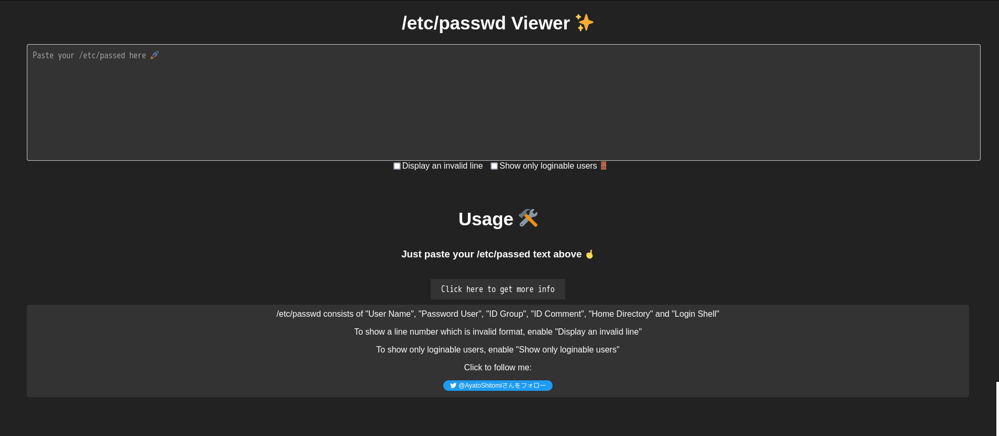
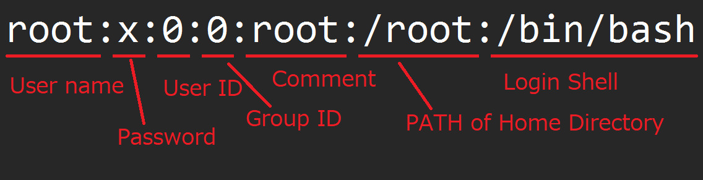

# Linux /etc/passwd Viewer

https://ayato-shitomi.github.io/passwd_viewer/

I'm learning to prepare the OSCP.

I created a simple viewer in `/etc/passwd` to find out which users can log in or not.

## Usage

In the Linux system, `/etc/passwd` consists of "User Name", "Password", "User ID", "Group ID", "Comment", "Home Directory" and "Login Shell".

- To show a line number which is invalid format, enable "Display an invalid line".
- To show only loginable users, enable "Show only loginable users".

## Technical point of view

I wanted to deploy to GitHub Pages, so I created everything in JavaScript and HTML.

